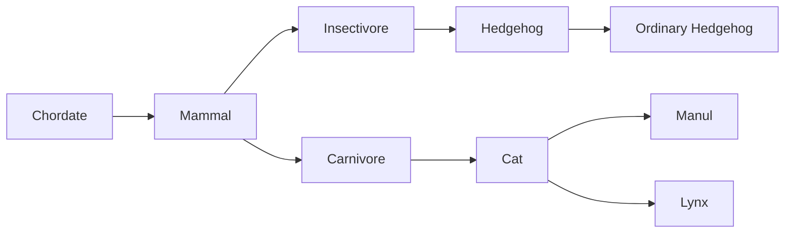

# course_java_gui_app
 **Short description:** this is designed to select the completion of tasks 1-6
 
### Task №1
In a computer game, a hero (class Hero) can move between two points (move method) in various ways: walk, ride a horse, fly, etc. Implement classes that allow
select and change during the execution of the program the method of movement hero using the strategy pattern.

### Task №2
Write an annotation with an integer parameter. create a class, containing public, protected and private methods (2-3 each type) with parameters, annotate any of them. Call from other class all annotated protected and private methods as many times as specified in the annotation parameter.

### Task №3
The hierarchy of the animal kingdom is given:

**Create a segregate method:**  
*segregate(SrcCollection, Collection1, Collection2, Collection3)*  
Where:  
`SrcCollection` - the original collection of animals  
`Collection1, Collection2, Collection3` – collections, in which hedgehogs, manulas and lynxes from SrcCollection  
**You need to be able to call the method as follows ways:**  
*segregate(Mammals, Hedgehogs, Felines, Carnivores)*  
*segregate(Carnivora, Chordata, Pallas' cat, Felidae)*  
*segregate(Hedgehogs, Insectivores, Carnivores, Carnivores)*  

### Task №4
Implement a translator program
- When the program starts, the dictionary is read in following format: word or expression | translation  
- Then the input file is read and the translation is performed  
- Translation is carried out according to the following rules:  
  - letter case is ignored
  - if the search word is not in the dictionary, it is displayed without translation  
  - if there are several suitable options, it is selected variant of the maximum length of the left side  
- The result of the translation is displayed in the console  
- Create and apply custom exclusions:  
  - InvalidFileFormatException  
  - FileReadException file does not exist, cannot be accessed file, etc.  

### Task №5
Using only the Stream API, implement the following methods:  
- a method that returns the average of a list of integers;  
- a method that converts all strings in the list to uppercase and adding the prefix "_new_" to them;  
- a method returning a list of squares of all occurring only once list items;  
- a method that takes a collection of strings as input and returns all strings starting with a given letter, sorted alphabetically;  
- a method that takes a collection as input and returns its last element or throws an exception if the collection empty;  
- a method that accepts an array of integers as input, returning the sum of even numbers, or 0 if there are no even numbers;  
- a method that converts all strings in the list to a Map, where the first character is the key, the rest are the value;  

### Task №6
Create a supervisor (control program) that controls execution of an abstract program.  
An abstract program runs in a separate thread and is a class with an enumerated type field that reflects its state:    
- UNKNOWN - before the first launch  
- STOPPING - stopped  
- RUNNING - running  
- FATAL ERROR - critical error  
and has a random state daemon thread that, in a given interval changes its state to random.  
Supervisor must have stop and start methods abstract program that change its state. Supervisor is a thread that cyclically polls an abstract
program, and if its state is STOPPING, restarts it. If state FATAL ERROR, then the operation of the abstract program
terminated by the supervisor. All state changes must be accompanied by corresponding messages in the console.
The supervisor must not miss any status of the abstract programs. Use constructs with wait/notify.
